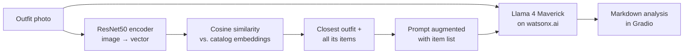

# Style Finder: Multimodal RAG for Fashion Analysis

Upload an outfit photo and Style Finder identifies the garments, describes the style, and lists matching catalog items with prices and purchase links. It is a small **multimodal Retrieval-Augmented Generation (RAG)** app: computer vision finds the closest outfit in a catalog, and a vision LLM writes the analysis using what was retrieved.

> **Origin and credits**
> This project was built while completing the lab *"Build a Style Finder Using Multimodal Retrieval and Search"* from the **IBM RAG and Agentic AI Professional Certificate** (IBM Skills Network).
> The base code was taken from IBM's lab repository, [`ibm-developer-skills-network/tyxva-swift-style`](https://github.com/ibm-developer-skills-network/tyxva-swift-style) (branch `1-start`). I completed it and then refactored it into the structure below. The original lab was written by Hailey Quach and is licensed under Apache 2.0 (see [LICENSE](LICENSE)).

## How it works



1. **Encode.** A pre-trained ResNet50 turns the image into a feature vector. The image is also Base64-encoded for the LLM.
2. **Retrieve.** Cosine similarity against the precomputed catalog embeddings finds the closest outfit. Every item in that outfit (name, price, link) is collected.
3. **Generate.** The items are injected into the prompt and sent with the image to `meta-llama/llama-4-maverick-17b-128e-instruct-fp8` on IBM watsonx.ai. If similarity is ≥ 0.8 the items are presented as an exact match; otherwise as similar items.
4. **Post-process.** The reply is cleaned into Markdown. If the model refuses or drops the item list, the retrieved items are still shown.

The catalog (`swift-style-embeddings.pkl`) was scraped from [taylorswiftstyle.com](https://taylorswiftstyle.com/) by the lab authors. Each row is an item with its name, price, link, outfit image URL and that image's ResNet50 embedding.

## Project structure

```
├── app.py                  # Entry point: parses CLI flags and launches the Gradio app
├── style_finder/
│   ├── config.py           # Settings (model, credentials, threshold), env-var overrides
│   ├── data.py             # Load and validate the catalog; look up items per outfit
│   ├── encoder.py          # ResNet50 image → vector + Base64
│   ├── retrieval.py        # Cosine-similarity search over catalog embeddings
│   ├── prompts.py          # RAG prompt construction and item-list safeguards
│   ├── llm.py              # watsonx.ai vision chat client
│   ├── formatting.py       # LLM output → display-ready Markdown
│   ├── pipeline.py         # StyleFinder: encode → retrieve → generate
│   └── ui.py               # Gradio Blocks interface
├── examples/               # Sample outfit photos shown in the UI
└── tests/                  # Unit tests (no GPU, model or API key needed)
```

## Getting started

Requires Python 3.11.

```bash
python3.11 -m venv venv
source venv/bin/activate
pip install -r requirements.txt
```

Download the catalog with the link in the lab's **"Step 3: Download the dataset"** and save it as `swift-style-embeddings.pkl` in the project root (or point `--dataset` / `STYLE_FINDER_DATASET` at it).

```bash
python app.py              # http://127.0.0.1:5000
python app.py --share      # also create a temporary public gradio.live link
```

### Credentials

Inside the IBM Skills Network lab environment no credentials are needed. Anywhere else, set your watsonx.ai credentials as environment variables (see [`.env.example`](.env.example)):

| Variable | Default | Purpose |
| --- | --- | --- |
| `WATSONX_APIKEY` | *(none)* | IBM Cloud API key |
| `WATSONX_PROJECT_ID` | `skills-network` | watsonx.ai project ID |
| `WATSONX_URL` | `https://us-south.ml.cloud.ibm.com` | Regional endpoint |
| `WATSONX_MODEL_ID` | Llama 4 Maverick 17B | Vision chat model |
| `STYLE_FINDER_DATASET` | `./swift-style-embeddings.pkl` | Catalog path |
| `STYLE_FINDER_SIMILARITY_THRESHOLD` | `0.8` | Exact-match cutoff |

## Tests

```bash
pip install -r requirements-dev.txt
pytest
```

## Tech stack

PyTorch / torchvision (ResNet50) · NumPy & pandas · IBM watsonx.ai (Llama 4 Maverick) · Gradio

## License

Apache 2.0, inherited from the original IBM Skills Network lab. See [LICENSE](LICENSE).
